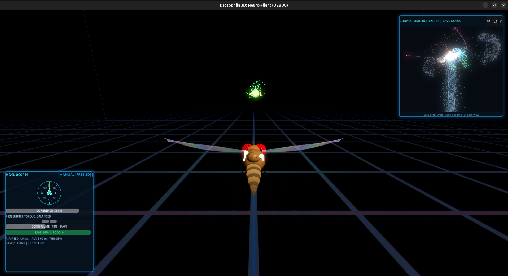
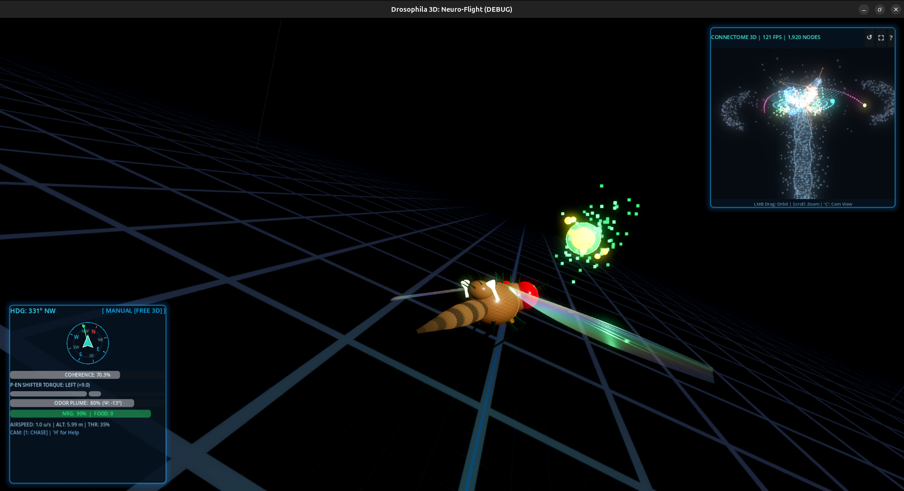

# 🪰 Drosophila Closed-Loop Compass Attractor & 3D Neuro-Flight Suite

<p align="center">
  
  
  
  
  
  
  
  
</p>

An end-to-end computational connectomics pipeline, biophysical simulation engine, and real-time interactive flight suite that interfaces with Janelia Research Campus's **NeuPrint API** (`hemibrain:v1.2.1`) to extract, analyze, and simulate the complete **closed-loop heading direction continuous attractor circuit** of the adult fruit fly (*Drosophila melanogaster*).

This project bridges nanoscale connectomics data with real-time biophysical continuous attractor neural network (CANN) dynamics through two distinct simulation environments and an interactive 3D WebGL morphology viewer:

1. **🎮 Drosophila 3D: Standalone Neuro-Flight Game (`./fruitfly_3d.sh`):** A high-performance 3D flight simulator built on the Godot 4 Forward+ Vulkan engine. Fly an anatomically articulated 3D fruit fly in six degrees of freedom, driven by a live 96-neuron CANN compass, volumetric odor plume chemotaxis, celestial sun navigation, and an interactive 3D holographic Central Complex connectome HUD operating at **120+ FPS**.
2. **🔬 Hardware-Accelerated Closed-Loop Simulator Toy (`run_toy.py`):** A dual-panel 2D/3D hybrid simulator in Pygame. Couples a 2D fly agent foraging in an odor-plume arena with real-time CANN ODE integration, a 3D anatomical brain point cloud, and floating avionics HUD.
3. **🌐 Interactive 3D WebGL Morphology Viewers ([`compass_dual_3d.html`](compass_dual_3d.html)):** Standalone Three.js browser inspection tools allowing 360° rotation and zoom of biological neuron skeletons extracted directly from the Janelia connectome.
4. **⚡ Safe Linear-Time Connectomics Pipeline (`main.py`):** Extracts biological connectivity, generates 3D morphology projections, and proves 100% network recurrence in $O(V + E)$ linear time, quantifying the biological $2.09\times$ feedback-to-feedforward torque driving force.

---

## 📸 Visual Showcase

### 1. Standalone 3D Neuro-Flight Game (Godot 4 Forward+ Engine)

| 3D Forward Chase Flight & Active Telemetry | Dynamic Banking Turn & Odor Chemotaxis |
| :---: | :---: |
|  |  |
| *High-speed 3D flight over the cybernetic grid arena. Features glassmorphism cockpit avionics (bottom-left) and the live 3D Central Complex connectome hologram (1,920 nodes @ 120 FPS, top-right).* | *Leftward banking maneuver toward a food plume: asymmetric P-EN shifter torque (+9.0) dynamically shifts the E-PG compass needle to heading 331° NW.* |

---

### 2. Hybrid 2D/3D Simulator Toy & Connectomics Topology

| 2D/3D Pygame Closed-Loop Simulator | 3D Connectome Skeleton Morphology | 2D Recurrent Ring Circuit |
| :---: | :---: | :---: |
|  |  |  |
| *Split-view simulator: 2D foraging torus with Sun beacon (left) and 3D Central Complex brain mesh with CANN attractor (right).* | *High-resolution 3D morphological reconstruction of paired E-PG compass (cyan) and P-EN shifter (magenta) neurons.* | *Concentric recurrent graph topology of 92 neurons (50 inner E-PG, 42 outer P-EN) with four-block synaptic connectivity.* |

> [!TIP]
> **Experience Drosophila 3D Flight:** Launch the standalone 3D engine immediately with `./fruitfly_3d.sh` (or run in Godot 4).  
> **Explore in Browser:** Open [`compass_dual_3d.html`](compass_dual_3d.html) directly in Chrome or Firefox for full 3D orbital inspection of the neuron skeletons.

---

## 🕹️ Interactive Simulation Environments

### Environment A: Drosophila 3D — Standalone Neuro-Flight (`./fruitfly_3d.sh`)

A production-grade, 120 FPS standalone 3D flight simulator built with the **Godot 4.3+ Forward+ Vulkan** pipeline, engineered specifically for high-throughput biological flight dynamics:

* **Biomechanical 6-DOF Flight Kinematics:** Full pitch, yaw, roll, climb, and dive physics with speed-dependent aerodynamic drag, lift forces, and inertial banking damping.
* **Procedural Drosophila Anatomy & PBR Shading:** Detailed multi-segment cuticle mesh with realistic chitin sheen, ruby-red compound eyes with radial bloom, fluttering iridescent wings with anisotropic light dispersion, and haltere gyroscopes.
* **Acoustic Wingbeat Engine:** Dynamic 200 Hz harmonic wing-tone generator whose pitch and amplitude shift proportionally with flight throttle.
* **Real-Time 3D Connectome Hologram PIP:** An interactive Picture-in-Picture display of the adult *Drosophila* Central Complex (1,920 nodes) rendering live synaptic firings, E-PG activity bump translation, and depth fog. Supports free orbit and zoom.
* **Glassmorphism Avionics Cockpit HUD:** Displays heading azimuth with cardinal rose, digital CANN bump coherence, differential P-EN shifter torque meter, bilateral antenna odor concentration, food proximity, and metabolic battery level.
* **Autonomous PFL3 Chemotaxis & Odor Tracking:** Toggle autonomous flight (`M`) to engage the biological PFL3 comparator circuit, navigating toward nutrient odor plumes via a bio-inspired Cast-and-Surge strategy.

```bash
# Launch Standalone Linux Binary (NVIDIA Prime offload & Vulkan optimized)
./fruitfly_3d.sh

# Or run via Godot 4 Editor / CLI
godot --path godot_game
```

#### Controls for Drosophila 3D:
| Control | Action |
| :--- | :--- |
| **`W` / `S`** | Forward Throttle / Brake |
| **`A` / `D`** or **`⬅️` / `➡️`** | Yaw Left / Right (Injects biological $\pm 45^\circ$ P-EN steering torque) |
| **`Space` / `Shift`** | 3D Altitude Climb / Dive |
| **`Q` / `E`** | 3D Roll Left / Right (Banking) |
| **`M`** | Toggle Operating Mode (`MANUAL [FREE 3D]` $\leftrightarrow$ `AUTO [PFL3 CHEMOTAXIS]`) |
| **`C`** or **`TAB`** | Cycle Camera Perspective (`1: Chase` $\to$ `2: FPV Eye` $\to$ `3: Orbit` $\to$ `4: Split`) |
| **`1` / `2` / `3` / `4`** | Jump directly to specific Camera Mode |
| **`T`** | Toggle Celestial Sun Beacon (Visual landmark cue) |
| **`LMB Drag (PIP)`** | Orbit 3D Connectome Hologram camera |
| **`Scroll Wheel`** | Zoom in / out on Connectome Hologram |
| **`R`** | Reset Flight Position & Compass Heading |
| **`F11`** | Toggle Fullscreen Mode |

---

### Environment B: Closed-Loop Compass Toy (`run_toy.py`)

A lightweight, hardware-accelerated 2D/3D hybrid simulator in Pygame and NumPy designed for rapid parameter exploration and algorithmic verification:

* **Panel 1 — 2D Flight Arena ($780\times 794\text{ px}$):** Vector fly agent navigating a continuous toroidal arena with Gaussian odor plumes, nutrient food pellets, and solar landmark tracking.
* **Panel 2 — Central Complex Subnetwork ($780\times 794\text{ px}$):** Three selectable modes:
  * **Mode 1 (`Key 1`):** High-fidelity 3D Central Complex point cloud (~1,920 nodes) with depth-fog shading, orbital camera controls, and anatomical callout tags.
  * **Mode 2 (`Key 2`):** Full-screen 48-node E-PG $\rightleftharpoons$ 48-node P-EN dual-ring continuous attractor with real-time 48-bar activity spectrum.
  * **Mode 3 (`Key 3`):** Synchronized split view showing the 3D anatomical brain above and the CANN dual-ring below.

```bash
# Standard Launch
./fly_env/bin/python run_toy.py

# High-Refresh 120 FPS Fullscreen
./fly_env/bin/python run_toy.py --fps 120 --fullscreen

# Direct 3D Brain Mesh Mode
./fly_env/bin/python run_toy.py --view-mode 1

# Headless CI Verification Test
./fly_env/bin/python run_toy.py --headless-test
```

#### Controls for Closed-Loop Toy:
| Control | Action |
| :--- | :--- |
| **`A` / `D`** or **`⬅️` / `➡️`** | Asymmetric Angular Velocity ($\dot{\theta}$) injected into P-EN shifters |
| **`W` / `S`** or **`⬆️` / `⬇️`** | Forward Throttle / Brake |
| **`TAB`** or **`1` / `2` / `3`** | Switch Panel 2 (`1: 3D Brain Mesh`, `2: Dual Ring`, `3: Split View`) |
| **`M`** | Toggle `MANUAL` / `AUTO` flight |
| **`L`** | Toggle 3D anatomical callout badges on/off |
| **`H`** | Cycle Cockpit HUD position |
| **`LMB Drag (Neural)`** | Free 3D orbital camera rotation around brain point cloud |
| **`Scroll (Neural)`** | Interactive 3D zoom in / out |
| **`LMB (Arena)`** | Drop / Reposition celestial Sun beacon |
| **`RMB (Arena)`** | Toggle Sun beacon retinotopic cue locking |
| **`P`** or **`F12`** | Save high-resolution PNG screenshot to `screenshots/` |
| **`Space`** | Pause / Resume ODE physics integration |
| **`R`** | Reset CANN bump to $0^\circ$ and respawn agent/food |
| **`ESC` / `Q`** | Quit application |

---

## 🧠 Scientific & Biological Foundation

### 1. The E-PG ⇄ P-EN Continuous Ring Attractor

In the central complex of *Drosophila*, the animal's internal heading azimuth is represented by a single, self-sustaining localized bump of action potentials in **E-PG neurons** (the fruit fly's "internal compass needle") within the donut-shaped **Ellipsoid Body (EB)**.

When the fly turns, asymmetric motor angular velocity signals from the lateral accessory lobes are transmitted to **P-EN shifter neurons** in the **Protocerebral Bridge (PB)**. Crucially, the axonal wiring between the PB and EB features an **anatomical phase shift of $\pm 1$ column ($\pm 45^\circ$)**:

```text
                  ┌────────────────────────────────────────────────────────┐
                  │       Protocerebral Bridge (PB Handlebar)              │
                  │       [L9] ... [L3] [L2] [L1] | [R1] [R2] [R3] ... [R9]│
                  └─────────▲───────────────────────────────────┬──────────┘
                            │ (Ascending E-PG Axons)            │ (P-EN Dendrites:
                            │                                   │  receives E-PG +
                            │                                   │  angular velocity)
                 ┌──────────┴──────────┐              ┌─────────▼──────────┐
                 │    E-PG Compass     │              │    P-EN Shifter    │
                 │   Needle (n=50)     │              │   Neurons (n=48)   │
                 └──────────▲──────────┘              └─────────┬──────────┘
                            │                                   │ (Phase-Shifted
                            │ (Local Recurrence)                │  Feedback: ±1 column)
                  ┌─────────┴───────────────────────────────────▼──────────┐
                  │              Ellipsoid Body (EB Donut Ring)            │
                  │   [Wedge 1] ──> [Wedge 2] ──> [Wedge 3] ... [Wedge 8]   │
                  │     ↺ Left Turn (PEN_L): CCW Shift (-45°) ↺            │
                  │     ↻ Right Turn (PEN_R): CW Shift (+45°) ↻            │
                  └────────────────────────────────────────────────────────┘
```

* **Left turns ($\dot{\theta} < 0$):** Excite left-hemisphere $P\text{-}EN_L$ neurons, which project feedback shifted **counter-clockwise ($-45^\circ$)**, pulling the E-PG excitation bump leftward.
* **Right turns ($\dot{\theta} > 0$):** Excite right-hemisphere $P\text{-}EN_R$ neurons, projecting feedback shifted **clockwise ($+45^\circ$)**, rotating the bump rightward.
* **The Biological $2.09\times$ Torque Ratio:** Connectomic data mining reveals that P-EN $\to$ E-PG feedback consists of **21,937 synapses**, whereas feedforward E-PG $\to$ P-EN connectivity comprises **10,479 synapses**. This biological asymmetric ratio ($2.09\times$) provides the physical driving torque necessary to swiftly overcome local attractor inertia and translate the heading bump during evasive flight maneuvers.

### 2. Mathematical Continuous Attractor Formulation

The continuous attractor neural network dynamics are integrated in real time using the following non-linear differential rate equations:

$$\tau \frac{d u_i}{dt} = -u_i + \sum_{j} W_{ij}^{\text{rec}} \, r_j + W^{\text{PEN}\to\text{EPG}} \left( v_{i - \delta} \cdot \max(0, -\dot{\theta}) + v_{i + \delta} \cdot \max(0, \dot{\theta}) \right) + I_i^{\text{ext}}$$

$$r_i = \frac{\left[ \max(0, u_i) \right]^2}{1 + \gamma \sum_k \left[ \max(0, u_k) \right]^2}$$

Where:
* $u_i, r_i$: Membrane potential and firing rate of E-PG neuron $i$.
* $W_{ij}^{\text{rec}}$: Gaussian recurrent excitatory connectivity kernel around the Ellipsoid Body.
* $\delta = 1$ column ($\pm 45^\circ$): Anatomical phase shift.
* $\gamma$: Divisive normalization factor providing global inhibitory stability without runaway excitation.
* $\dot{\theta}$: Angular velocity command from steering motor commands or autonomous PFL3 guidance.

---

## ⚡ Safe Connectomics Graph Analysis: $O(V + E)$ Linear Time

Extracting the full attractor subnetwork from Janelia NeuPrint yields **92 neurons and 2,650 directed synaptic connections** (with total synaptic weight $\ge 3$).

> [!CAUTION]
> **Safety Constraint on Dense Recurrent Graphs:**  
> In dense cyclic connectomics graphs with $\sim 90$ nodes and $>2,600$ edges, running naive cycle enumeration (such as `nx.algorithms.cycles.simple_cycles`) triggers a combinatorial explosion ($> 10^{14}$ paths), consuming gigabytes of memory within seconds.
>
> This pipeline exclusively utilizes **strictly linear-time $O(V + E)$ graph algorithms**:
> * **DAG Check (`nx.is_directed_acyclic_graph`):** Runs in $\sim 2\text{ ms}$, returns `False` (proving recurrence).
> * **Strongly Connected Components (`nx.strongly_connected_components`):** Demonstrates that **100% (92 of 92 neurons)** form a single unified recurrent core.
> * **Reciprocity Calculation (`nx.reciprocity`):** Evaluates bidirectional symmetry in $O(E)$ time, finding an extraordinary **85.43%** combined network reciprocity.
> * **Targeted Cycle Extraction (`nx.find_cycle`):** Isolates representative feedback loops (e.g. `387364605 ⇄ 387023620`) in $O(V + E)$ time.

---

## 📊 Measured Network & Connectome Metrics

### 1. Four-Block Functional Connectivity Matrix

| Functional Block | Circuit Role | Directed Edges | Connection Density | Total Synapses | Mean Synapse Weight |
| :--- | :--- | :---: | :---: | :---: | :---: |
| **`E-PG -> E-PG`** | Local Compass Recurrent Excitation | `487` | `19.9%` | `7,706` | `15.82` |
| **`E-PG -> P-EN`** | Ascending Compass Signal to Shifter | `548` | `26.1%` | `10,479` | `19.12` |
| **`P-EN -> E-PG`** | Phase-Shifted Angular Velocity Feedback | `681` | `32.4%` | `21,937` | `32.21` |
| **`P-EN -> P-EN`** | Lateral Shifter Coordination | `934` | `54.2%` | `11,252` | `12.05` |
| **Total Circuit** | **Complete Closed-Loop Attractor** | **`2,650`** | **`31.6%`** | **`51,374`** | **`19.39`** |

### 2. Recurrent Topology & Dynamical Indicators

| Metric | E-PG Compass Subnetwork | Full E-PG + P-EN Attractor | Biological Interpretation |
| :--- | :---: | :---: | :--- |
| **Neuron Count (Nodes)** | `50` | `92` (50 E-PG + 42 P-EN) | Complete heading maintenance & steering subnetwork |
| **Directed Synaptic Edges** | `487` | `2,650` (weight $\ge 3$) | Dense cross-population recurrent connectivity |
| **Total Synapses** | `7,706` | `51,374` | Nanoscale synaptic wiring substrate |
| **Average Degree (In / Out)** | `9.74` | `28.80` | High degree supporting robust bump formation |
| **Network Reciprocity** | `83.78%` | `85.43%` | High bidirectional coupling preserving attractor stability |
| **Inter-Population Reciprocity** | — | `79.41%` (488 mutual pairs) | Tightly coupled feedback loop between needle and shifters |
| **Unified Recurrent Core** | `48 / 50` (96.0%) | **`92 / 92` (100.0%)** | Fully unified closed-loop recurrent core |
| **Feedback / Feedforward Ratio** | — | **`2.09×`** ($21,937 / 10,479$) | Motor shifter feedback provides dominant driving torque |

---

## 🚀 Quickstart & Installation

### 1. Launch Drosophila 3D Flight Game (Standalone)

The standalone 3D flight game can be executed directly without setting up a Python environment:

```bash
# Clone the repository
git clone https://github.com/iDharshan/fruitfly.git
cd fruitfly

# Launch standalone 3D game
./fruitfly_3d.sh
```

*(Note: Precompiled Linux executable and data pack reside in [`build/`](build/). Target system: Linux x86_64 with Vulkan-compatible GPU).*

---

### 2. Setup Python Environment & Launch Closed-Loop Toy

```bash
# Create and activate virtual environment
python3 -m venv fly_env
source fly_env/bin/activate

# Install required dependencies
pip install --upgrade pip
pip install -r requirements.txt

# Launch interactive 2D/3D Pygame simulator
./fly_env/bin/python run_toy.py
```

---

### 3. Open Standalone 3D WebGL Neuron Viewer

Open [`compass_dual_3d.html`](compass_dual_3d.html) in any modern web browser:

```bash
# Linux
xdg-open compass_dual_3d.html

# or
google-chrome compass_dual_3d.html
# or
firefox compass_dual_3d.html
```

---

### 4. Run NeuPrint Connectomics Extraction Pipeline

To query Janelia's NeuPrint servers and regenerate the connectomics topology:

1. Obtain a free access token from [neuprint.janelia.org](https://neuprint.janelia.org) (*Sign In $\to$ Account $\to$ Copy Token*).
2. Save your token in a `.env` file:
   ```bash
   echo 'NEUPRINT_APPLICATION_CREDENTIALS="your_actual_token_here"' > .env
   ```
3. Run the pipeline:
   ```bash
   ./fly_env/bin/python main.py
   ```

---

### 5. Automated Verification & Test Suite

```bash
# Verify CANN ODE integration and 2.09x torque dynamics
./fly_env/bin/python tests/test_circuit.py

# Verify 2D agent kinematics and sensory bearing calculations
./fly_env/bin/python tests/test_agent.py

# Verify food system spawning and odor gradient plume logic
./fly_env/bin/python tests/test_food.py

# Run headless simulator frame-render smoke test
./fly_env/bin/python run_toy.py --headless-test
```

---

## 📂 Repository Structure

```text
fruitfly/
├── fruitfly_3d.sh                   # Standalone Linux launcher for Drosophila 3D (RTX/Vulkan optimized)
├── build/                           # Precompiled standalone game binaries & packages
│   ├── fruitfly_3d.x86_64           # Standalone Godot 4 Forward+ Linux binary
│   └── fruitfly_3d.pck              # Packaged game assets, shaders, and scenes
│
├── godot_game/                      # Complete Godot 4 3D Neuro-Flight Project
│   ├── project.godot                # Godot project configuration (Forward+ Vulkan)
│   ├── scenes/                      # 3D scenes (MainArena, FlyAgent, AvionicsHUD, Hologram)
│   ├── scripts/                     # GDScript modules (CANN port, 6-DOF flight, PFL3 chemotaxis)
│   ├── shaders/                     # High-performance spatial shaders (chitin, wings, dark grid)
│   └── assets/                      # Audio SFX, icons, and textures
│
├── run_toy.py                       # Executable launcher for 2D/3D Pygame simulator
├── main.py                          # NeuPrint closed-loop attractor extraction & analysis pipeline
├── requirements.txt                 # Python dependencies (neuprint, navis, pygame, scipy, etc.)
├── README.md                        # Documentation, scientific theory, and visual gallery
│
├── screenshots/                     # High-resolution simulator and game captures
│   ├── godot_3d_flight.png          # 3D chase flight over grid arena with HUD & connectome PIP
│   ├── godot_3d_banking_turn.png    # 3D banking turn toward food plume with P-EN torque deflection
│   ├── toy_split_view.png           # Pygame simulator: 2D flight arena + 3D Central Complex
│   ├── toy_3d_brain_mode.png        # Pygame Mode 1: 3D Drosophila brain & VNC mesh
│   └── toy_dual_ring_mode.png       # Pygame Mode 2: Full-panel dual-ring CANN attractor
│
├── toy/                             # Modular Pygame simulation engine
│   ├── circuit.py                   # Continuous attractor (CANN) ODE engine (divisive norm, 2.09x torque)
│   ├── agent.py                     # 2D FlyAgent kinematics, boundary wrapping, particle wake
│   ├── food.py                      # FoodSystem, continuous radial odor plumes, eating detection
│   ├── brain_cloud.py               # 3D Drosophila CNS point cloud (1,920 nodes, depth-fog)
│   ├── renderer.py                  # Hardware-accelerated Pygame renderer with cached bloom glow
│   └── config.py                    # Display geometry, CANN parameters, color themes
│
├── tests/                           # Automated test suite
│   ├── test_circuit.py              # CANN bump stability, torque response, and cue locking tests
│   ├── test_agent.py                # Kinematics and sensory bearing tests
│   └── test_food.py                 # Food spawning, odor gradient, and eating mechanics
│
├── compass_dual_ring.png            # High-DPI 2D dual concentric ring topology
├── compass_dual_3d.html             # Standalone interactive 3D WebGL dual skeleton viewer
├── compass_dual_3d_preview.png     # High-DPI 2D projection preview of 3D skeletons
└── compass_epg_pen_circuit.graphml  # Full directed connectome graph export with synaptic metadata
```

---

## 📚 References & Scientific Literature

1. **E-PG and P-EN Ring Attractor Dynamics:**  
   Turner-Evans, D. et al. (2020). *The neuroanatomical ultrastructure and function of a heading direction circuit.* **Neuron**, 108(1), 145-163. [doi:10.1016/j.neuron.2020.08.006](https://doi.org/10.1016/j.neuron.2020.08.006).
2. **Neural Mechanism for Heading Computation:**  
   Green, J. et al. (2017). *A neural circuit architecture for angular velocity integration in Drosophila.* **Nature**, 546(7656), 101-106. [doi:10.1038/nature22343](https://doi.org/10.1038/nature22343).
3. **Connectomics of the Adult Drosophila Central Complex:**  
   Hulse, B.K. et al. (2021). *A connectome of the Drosophila central complex reveals network motifs suitable for flexible navigation and motor control.* **eLife**, 10:e66039. [doi:10.7554/eLife.66039](https://doi.org/10.7554/eLife.66039).
4. **Janelia Hemibrain Connectome Dataset:**  
   Scheffer, L.K. et al. (2020). *A connectome and analysis of the adult Drosophila central brain.* **eLife**, 9:e57443. [doi:10.7554/eLife.57443](https://doi.org/10.7554/eLife.57443).
5. **Morphology and Skeleton Analysis:**  
   Bates, A.S. et al. (2020). *navis: Morphology and connectivity analysis of neuronal data.* [navis.readthedocs.io](https://navis.readthedocs.io/).

---

## 📄 License

This project is licensed under the MIT License — see the [LICENSE](LICENSE) file for details.
