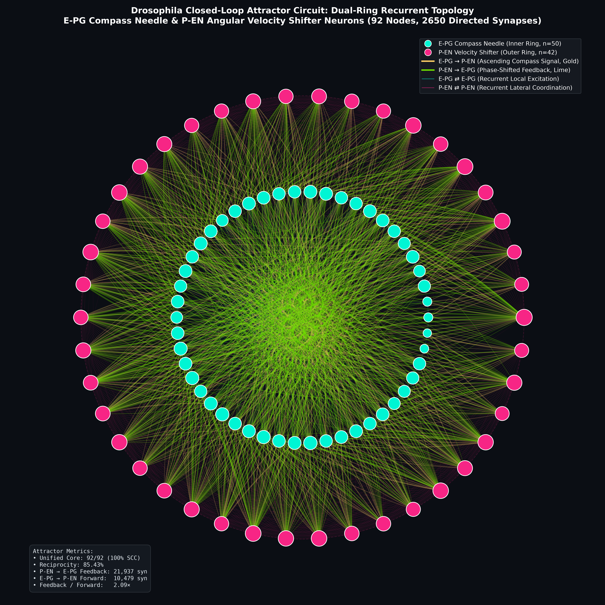
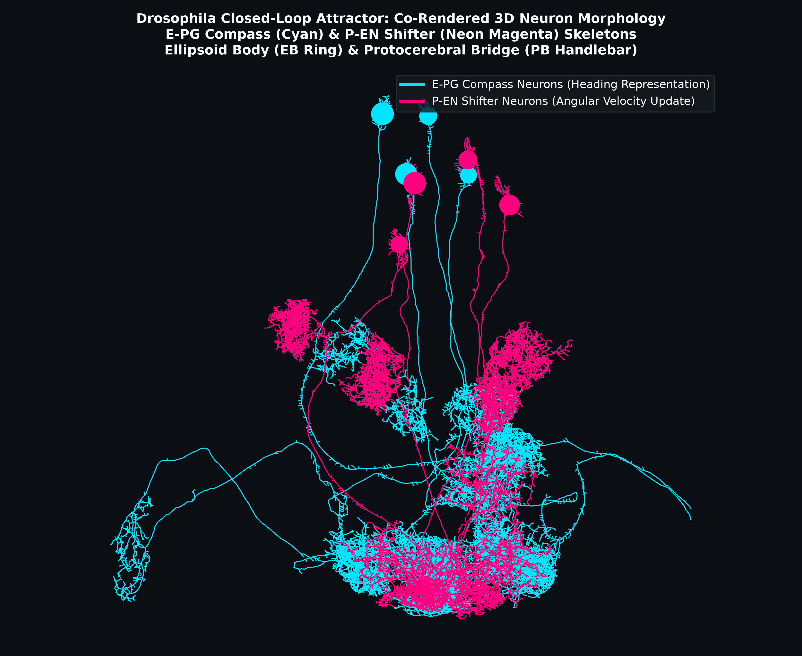
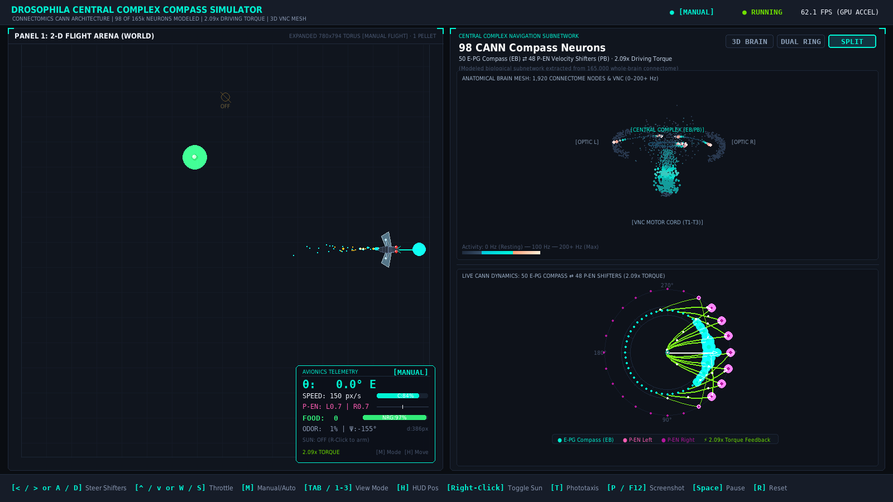
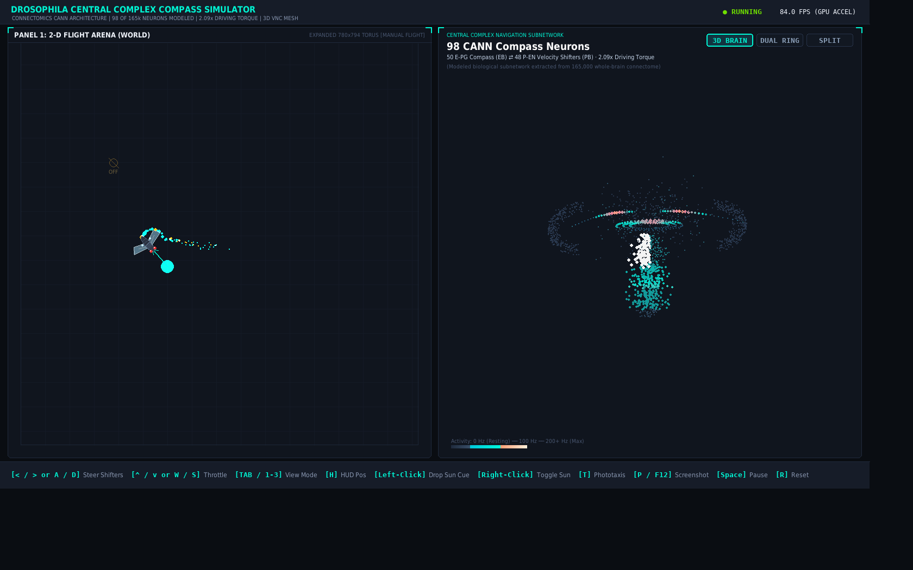
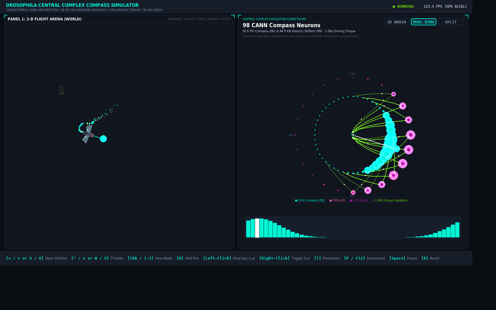
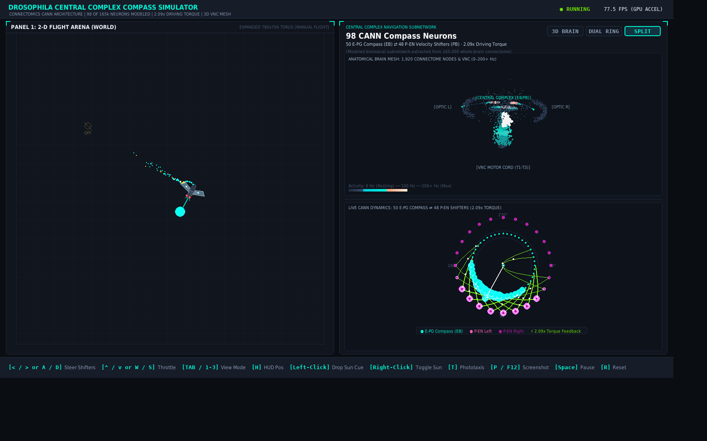

# 🪰 Drosophila Closed-Loop Compass Attractor Circuit (E-PG + P-EN)

<p align="center">
  
  
  
  
  
  
  
</p>

An end-to-end computational connectomics pipeline and interactive simulation suite that interfaces with Janelia Research Campus's **NeuPrint API** (`hemibrain:v1.2.1`) to extract, analyze, and simulate the complete **closed-loop heading direction attractor circuit** of the adult fruit fly (*Drosophila melanogaster*).

The project bridges connectomic graph analysis with real-time biophysical continuous attractor neural dynamics:
1. **Biological Data Mining:** Extracts connectivity and 3D skeletons for the **50 E-PG Compass Neurons** (*Ellipsoid Body – Protocerebral Bridge – Gall*) and **42–48 P-EN Shifter Neurons** (*Protocerebral Bridge – Ellipsoid Body – Noduli*).
2. **Topological Graph Analysis:** Proves $100\%$ network recurrence in linear time $O(V + E)$, characterizing four-block synaptic connectivity and the biological $2.09\times$ feedback-to-feedforward torque driving force.
3. **Interactive 3D WebGL Viewer:** Standalone browser-based inspection of full 3D neuron skeleton morphology.
4. **Hardware-Accelerated Closed-Loop Simulator Toy (`run_toy.py`):** Real-time 60–120 FPS Pygame simulation coupling a 98-neuron continuous attractor network (CANN) with a 2D fly agent, interactive visual landmark (Sun beacon), and a 3D anatomical Drosophila brain point cloud.

---

## 📸 Visual Gallery

| 1. 2D Dual-Ring Recurrent Topology | 2. Co-Rendered 3D Neuron Morphology | 3. Real-Time Closed-Loop Simulator Toy |
| :---: | :---: | :---: |
|  |  |  |
| *Concentric circular topology of 92 neurons (50 inner E-PG cyan, 42 outer P-EN magenta).* | *3D projection of matched E-PG (cyan) and P-EN (magenta) neurons across EB and PB.* | *Live continuous attractor simulation toy with 2D fly agent, sun cue, and floating avionics HUD.* |

> [!TIP]
> **Interactive 3D WebGL Viewer:** Open [`compass_dual_3d.html`](compass_dual_3d.html) directly in any web browser to rotate, zoom, and inspect full 3D morphology of both populations in real-time WebGL.
>
> **Live Closed-Loop Simulator Toy:** Launch [`run_toy.py`](run_toy.py) to fly the 2D agent and steer the biological continuous attractor in real-time at 60–120 FPS!

---

## 🎮 Interactive Closed-Loop Compass Toy (`run_toy.py`)

Bring the connectomics blueprint to life in an **interactive, real-time closed-loop simulation toy**. Rather than viewing static graphs, the simulator integrates live **continuous attractor neural dynamics (CANN)** at 60–120 FPS, translating user angular velocity commands into P-EN shifter activation, phase-shifted synaptic feedback torque ($2.09\times$), E-PG bump rotation, and physical steering of an autonomous 2D fruit fly agent leaving a bioluminescent particle wake.

<p align="center">
  
  <br>
  <em>Figure: Full simulator interface showing Panel 1 (Expanded 2D Flight Arena with Sun beacon, retinotopic bearing ray, and bottom-right Avionics HUD) and Panel 2 (Partitioned Neural Section showing upper 3D anatomical brain mesh and lower CANN dual-ring attractor).</em>
</p>

### 📺 View Mode Showcase (Toggle via `TAB` or `1` / `2` / `3`)

The simulator features three distinct, high-fidelity visualization modes for Panel 2:

| Mode 1: 3D Anatomical Brain Mesh (`[1]`) | Mode 2: Full Dual-Ring Attractor (`[2]`) | Mode 3: Clean Split-Screen View (`[3]`) |
| :---: | :---: | :---: |
|  |  |  |
| *1,920+ connectome nodes across Optic Lobes, Central Complex (EB/PB), and VNC motor cord with depth-fog and 0–200+ Hz firing glow.* | *Full-screen 48-node E-PG compass ⇄ 48-node P-EN shifters with 48-bar real-time activity spectrum at 120+ FPS.* | *Clean vertical partitioning: live 3D anatomical brain activity map above and dual-ring CANN with synaptic torque arcs below.* |

---

### 🕹️ How to Launch

```bash
# Standard Launch (Windowed 1600x900 @ 60 FPS)
./fly_env/bin/python run_toy.py

# High-Refresh Fullscreen Mode (120 FPS)
./fly_env/bin/python run_toy.py --fps 120 --fullscreen

# Automated Headless CI Verification Test
./fly_env/bin/python run_toy.py --headless-test
```

---

### 🎮 Simulator Controls & Keybindings

| Key / Mouse Action | Biological / Simulation Function |
| :--- | :--- |
| **`⬅️ / ➡️` or `A / D`** | **Motor Angular Velocity ($\dot{\theta}$):** Injects asymmetric drive into Left ($P\text{-}EN_L$) or Right ($P\text{-}EN_R$) shifter banks, causing $\pm 45^\circ$ shifted feedback torque to rotate the E-PG bump. |
| **`⬆️ / ⬇️` or `W / S`** | **Forward Throttle:** Accelerate forward or decelerate/brake the 2D fly agent. |
| **`M`** | **Operating Mode Toggle:** Switches between `MANUAL` (default keyboard control) and `AUTO` (mode toggle with HUD indicator). |
| **`TAB` or `1 / 2 / 3`** | **View Mode Switcher:** Toggle Panel 2 between `[1] 3D Brain Mesh`, `[2] Dual Ring Attractor`, and `[3] Clean Split View`. |
| **`H`** | **Cycle HUD Position:** Moves floating cockpit avionics HUD (*Arena Bottom-Right* $\rightarrow$ *Arena Top-Right* $\rightarrow$ *Neural Panel* $\rightarrow$ *Hidden*). |
| **`Left-Click (Arena)`** | **Drop / Reposition Visual Landmark (Sun):** Places a visual beacon in the arena. |
| **`Right-Click (Arena)`** | **Toggle Landmark Cue:** Enables/disables visual retinotopic cue locking without restricting free flight (off by default). |
| **`T`** | **Toggle Phototaxis:** Optional autonomous beacon homing / target tracking mode. |
| **`P` / `F12`** | **Direct Screenshot Capture:** Saves high-resolution PNG to `screenshots/` with an on-screen confirmation toast. |
| **`Space`** | **Pause / Resume:** Freezes ODE integration and kinematics. |
| **`R`** | **Reset System:** Re-initializes bump to $0^\circ$, centers the fly agent, resets score/energy, and respawns a fresh food pellet. |
| **`C`** | **Clear Cue:** Removes the visual landmark from the arena. |
| **`ESC` / `Q`** | **Quit:** Cleanly closes simulator window. |

---

### 🔬 Architecture & Real-Time Dashboard Panels

#### 1. Panel 1: 2-D Flight Arena (Expanded $780\times 794\text{ px}$ Torus)
- **Vector Drosophila Anatomy:** Rendered with ruby-red compound eyes (radial bloom), segmented thorax and abdomen tergites, delicate fluttering iridescent wings with primary and secondary veins, vibrating halteres (gyroscopic balance organs), and directional laser guidance beam.
- **Dynamic Food System & Radial Odor Plumes:** Discrete nutrient pellets spawn with continuous Gaussian radial odor fields ($C(d) = \exp(-d^2 / 2\sigma^2)$). Analytical spatial gradients determine local odor concentration and relative heading bearing ($\Psi$).
- **Foraging & Eating Mechanics:** When the fly approaches within 22 px of a food pellet, it consumes it, triggering a bioluminescent expanding halo ring, outward sparkle particles, a floating `+1` score popup, metabolic energy boost (`+25%`), and immediate pellet respawn at a random distance.
- **Torus Boundary Wrapping & Particle Wake:** Smooth toroidal edge wrapping with aerodynamic bioluminescent particle exhaust.
- **Visual Landmark (Sun Beacon):** Multi-layer golden solar corona with 12 radiant flares, pulsing core, and dashed retinotopic sensory beam connecting the Sun to the fly's eye with live egocentric bearing readout ($\Psi$). Completely optional and off by default.
- **Floating Avionics Cockpit HUD ($250\times 175\text{ px}$):** Glassmorphism semi-transparent HUD card displaying:
  - **Operating Mode Badge:** `[MANUAL]` (Cyan) or `[AUTO]` (Emerald)
  - **Digital Heading:** Decoded azimuth $\hat{\theta}$ in degrees with cardinal direction
  - **Flight Speedometer & Stability:** Current speed with digital CANN bump coherence bar
  - **P-EN Differential Steering:** Live Left/Right shifter rates with balance deflection meter
  - **Metabolism & Score:** Consumed food counter with live dynamic energy bar (`NRG: %`)
  - **Odor Sensor:** Live concentration percentage, egocentric relative bearing ($\Psi$), and distance to nearest pellet
  - **Biological Torque Ratio:** Fixed $2.09\times$ connectomic driving ratio indicator

#### 2. Panel 2: Central Complex Navigation Subnetwork ($780\times 794\text{ px}$)
- **Mode 1: 3D Anatomical Brain & VNC Mesh:** 1,920+ connectome nodes covering Optic Lobes, Protocerebrum, Central Complex, and Ventral Nerve Cord (T1 foreleg, T2 wing power, T3 hindleg) with real-time firing dynamics ($0 - 200+\text{ Hz}$) and depth-fog.
- **Mode 2: Full Dual-Ring CANN Attractor:** Full-screen 48-node E-PG compass (Ellipsoid Body) $\rightleftharpoons$ 48-node P-EN shifter (Protocerebral Bridge) rings with live 48-bar activity spectrum.
- **Mode 3: Clean Partitioned Split View:** Upper sub-panel displays the 3D anatomical brain & VNC with strict bounding box clipping; Lower sub-panel displays the live CANN dual-ring with 16 EB wedge spokes, traveling action potential spark dots, and badged color swatches.
- **Explicit Connectomics Context:** Subnetwork header clearly identifies the **98 modeled CANN compass neurons** (50 E-PG + 48 P-EN) within the adult *Drosophila* 165,000 whole-brain connectome.

---

## 🧠 Scientific & Biological Background: The E-PG ⇄ P-EN Shifter Loop

In the central complex of *Drosophila*, internal heading direction is maintained as a localized bump of excitation within a continuous ring attractor network. During turns, this activity bump must shift around the ring to faithfully reflect physical head rotation. This is accomplished via an anatomically phase-shifted recurrent feedback loop between **E-PG** and **P-EN** neurons:

```text
                  ┌────────────────────────────────────────────────────────┐
                  │       Protocerebral Bridge (PB Handlebar)              │
                  │       [L9] ... [L3] [L2] [L1] | [R1] [R2] [R3] ... [R9]│
                  └─────────▲───────────────────────────────────┬──────────┘
                            │ (Ascending E-PG Axons)            │ (P-EN Dendrites:
                            │                                   │  receives E-PG +
                            │                                   │  angular velocity)
                 ┌──────────┴──────────┐              ┌─────────▼──────────┐
                 │    E-PG Compass     │              │    P-EN Shifter    │
                 │   Needle (n=50)     │              │   Neurons (n=48)   │
                 └──────────▲──────────┘              └─────────┬──────────┘
                            │                                   │ (Phase-Shifted
                            │ (Local Recurrence)                │  Feedback: ±1 column)
                  ┌─────────┴───────────────────────────────────▼──────────┐
                  │              Ellipsoid Body (EB Donut Ring)            │
                  │   [Wedge 1] ──> [Wedge 2] ──> [Wedge 3] ... [Wedge 8]   │
                  │     ↺ Left Turn (PEN_L): CCW Shift (-45°) ↺            │
                  │     ↻ Right Turn (PEN_R): CW Shift (+45°) ↻            │
                  └────────────────────────────────────────────────────────┘
```

### Key Anatomical Principles:
1. **Compass Needle (E-PG):** Each E-PG neuron extends dendrites in an Ellipsoid Body wedge and sends axonal projections to a specific Protocerebral Bridge glomerulus (e.g., PB column L3 or R3), encoding current heading azimuth ($\theta$).
2. **Angular Velocity Modulation (P-EN):** P-EN neurons in the PB receive excitation from E-PGs as well as asymmetrical turn-rate signals from the lateral accessory lobes / noduli representing angular velocity ($\dot{\theta}$).
3. **Anatomical Phase Shift ($\pm 1$ PB Column / $\pm 45^\circ$ EB Offset):**
   - P-EN neurons originating in the **Left PB** project back to the EB shifted by **1 wedge counter-clockwise** ($\Delta \theta = -45^\circ$).
   - P-EN neurons originating in the **Right PB** project back to the EB shifted by **1 wedge clockwise** ($\Delta \theta = +45^\circ$).
4. **Closed-Loop Dynamic Steering:** When the fly rotates to the left, left-hemisphere P-EN neurons fire more vigorously, injecting phase-shifted feedback into the EB that pulls the activity bump leftward. Asymmetric motor input thus dynamically rotates the compass needle!
5. **Asymmetric Synaptic Weight Driving Force:** Feedback from P-EN to E-PG (**21,937 synapses**) is more than **2.09× stronger** than feedforward E-PG to P-EN excitation (**10,479 synapses**), ensuring strong driving torque to lock and translate the activity bump.

---

## ⚡ Safe Graph Topology & Cycle Analysis: $O(V + E)$ Linear Time

The full closed-loop attractor network extracted from NeuPrint consists of **92 neurons and 2,650 directed synaptic connections** (with total synaptic weight $\ge 3$).

> [!CAUTION]
> **CRITICAL SAFETY CONSTRAINT: Why `nx.algorithms.cycles.simple_cycles(G)` Freezes Systems:**  
> In dense recurrent connectomics graphs with ~90 nodes and >2,600 edges, enumerating elementary directed cycles via Johnson's algorithm encounters a factorial combinatorial explosion ($> 10^{14}$ cycles). Cycle enumeration will consume dozens of gigabytes of RAM in seconds, thrash swap space, and hard-freeze the operating system.

### Safe Linear-Time $O(V + E)$ Verification:
To verify recurrence with zero risk of memory exhaustion, this pipeline employs mathematically sound linear-time graph theory checks:
- **Directed Acyclic Graph Check (`nx.is_directed_acyclic_graph`):** Runs topological sort in $O(V + E)$ (~2 ms). Returns `False`, formally proving the existence of recurrent directed loops.
- **Strongly Connected Components (`nx.strongly_connected_components`):** Identifies recurrent modules in $O(V + E)$ (~2 ms). Proves that **all 92 of 92 neurons (100%)** form a single, unified recurrent core.
- **Directed Reciprocity (`nx.reciprocity`):** Computes bidirectional symmetry in $O(E)$ time, revealing an exceptional **85.43%** combined network reciprocity (and E-PG subnetwork reciprocity: **83.78%**), with **488** inter-population mutual pairs (79.41% inter-population reciprocity).
- **Exemplar Cycle Extraction (`nx.find_cycle`):** Isolates specific directed feedback loops (e.g., `387364605 ⇄ 387023620`) in linear time without exponential state-space traversal.

---

## 📊 Measured Network & Attractor Dynamics Metrics

### 1. Four-Block Functional Connectivity Breakdown

| Functional Block | Biological / Circuit Role | Directed Edges | Connection Density | Total Synapses | Mean Synapse Weight |
| :--- | :--- | :---: | :---: | :---: | :---: |
| **`E-PG -> E-PG`** | Local Compass Recurrent Excitation | `487` | `19.9%` | `7,706` | `15.82` |
| **`E-PG -> P-EN`** | Ascending Compass Signal to Motor Shifter | `548` | `26.1%` | `10,479` | `19.12` |
| **`P-EN -> E-PG`** | Phase-Shifted Angular Velocity Feedback | `681` | `32.4%` | `21,937` | `32.21` |
| **`P-EN -> P-EN`** | Lateral Shifter Coordination | `934` | `54.2%` | `11,252` | `12.05` |
| **Total Circuit** | **Closed-Loop Ring Attractor** | **`2,650`** | **`31.6%`** | **`51,374`** | **`19.39`** |

### 2. Recurrent Topology & Dynamical Indicators

| Metric | Single E-PG Circuit | Full E-PG + P-EN Attractor | Biological Interpretation |
| :--- | :---: | :---: | :--- |
| **Neuron Population (Nodes)** | `50` | `92` (50 E-PG + 42 P-EN) | Complete heading maintenance + steering system |
| **Directed Synaptic Edges** | `487` | `2,650` (weight $\ge 3$) | Full cross-population connectivity matrix |
| **Total Synapses** | `7,706` | `51,374` | Comprehensive synaptic substrate |
| **Average Degree (In / Out)** | `9.74` | `28.80` | Dense interconnectivity across columns and wedges |
| **Combined Reciprocity** | `83.78%` | `85.43%` | High bidirectional coupling reinforcing state stability |
| **Inter-Population Reciprocity** | — | `79.41%` (488 mutual pairs) | Tight feedback coupling between needle and shifters |
| **Unified Recurrent Core Size** | `48 / 50` (96.0%) | **`92 / 92` (100.0%)** | Unbroken closed-loop recurrent core across all neurons |
| **$\frac{\text{Feedback}}{\text{Feedforward}}$ Ratio** | — | **`2.09×`** ($21,937 / 10,479$) | Motor shifter feedback exerts dominant driving torque |

---

## 📂 Repository Structure

```text
fruitfly/
├── main.py                          # NeuPrint closed-loop attractor extraction & analysis pipeline
├── run_toy.py                       # Executable launcher for interactive real-time simulator
├── requirements.txt                 # Python dependencies (neuprint, navis, pygame, scipy, etc.)
├── .gitignore                       # Excludes virtual environments, cache, and sensitive tokens
├── README.md                        # Project documentation, scientific theory, and visual gallery
│
├── screenshots/                     # Verified high-resolution simulator captures
│   ├── toy_split_view.png           # Split view: 3D brain mesh + dual ring CANN + avionics HUD
│   ├── toy_eat_event.png            # Foraging eat event: expanding halo, sparkles, +1 score
│   ├── toy_3d_brain_mode.png        # Full-panel 3D Drosophila brain & VNC mesh (0-200+ Hz)
│   ├── toy_dual_ring_mode.png       # Full-panel dual ring attractor with 48-bar activity spectrum
│   └── toy_split_flight.png         # Split view during active manual steering flight
│
├── toy/                             # Modular interactive simulator engine
│   ├── __init__.py                  # Package exports
│   ├── config.py                    # Display geometry, CANN parameters, colors, and layout
│   ├── circuit.py                   # Continuous attractor (CANN) ODE engine (divisive norm, 2.09x torque)
│   ├── agent.py                     # 2D FlyAgent kinematics, boundary wrapping, and particle wake
│   ├── food.py                      # FoodSystem, continuous radial odor plumes, & eating collision
│   ├── brain_cloud.py               # 3D Drosophila CNS point cloud (1,920 nodes, depth-fog, 0-200+ Hz)
│   ├── renderer.py                  # Hardware-accelerated Pygame renderer with cached bloom glow
│   └── telemetry.py                 # Real-time telemetry history tracking
│
├── tests/                           # Automated test suite
│   ├── test_circuit.py              # Mathematical CANN bump stability, torque, & cue locking tests
│   ├── test_agent.py                # FlyAgent translation, boundary wrap, & sensory bearing tests
│   └── test_food.py                 # FoodSystem spawning, odor field gradient, & eating mechanics
│
├── compass_dual_ring.png            # High-DPI (300 DPI) 2D dual concentric ring topology
├── compass_dual_3d.html             # Standalone interactive 3D WebGL dual skeleton viewer
├── compass_dual_3d_preview.png     # High-DPI 2D projection preview of dual 3D skeletons
└── compass_epg_pen_circuit.graphml  # Full E-PG + P-EN directed graph export with metadata
```

---

## 🚀 Getting Started

### 1. Environment Setup

```bash
# Clone repository
git clone https://github.com/iDharshan/fruitfly.git
cd fruitfly

# Create and activate virtual environment
python3 -m venv fly_env
source fly_env/bin/activate

# Install required packages
pip install --upgrade pip
pip install -r requirements.txt
```

### 2. Configure Credentials (for NeuPrint Pipeline)

Obtain an access token from [neuprint.janelia.org](https://neuprint.janelia.org) (*Sign In $\to$ Account $\to$ Copy Token*).

Add your token to `.env` in the repository root (this file is excluded by `.gitignore`):

```bash
echo 'NEUPRINT_APPLICATION_CREDENTIALS="your_actual_token_here"' > .env
```

### 3. Execute Connectomics Analysis Pipeline

```bash
./fly_env/bin/python main.py
```

### 4. Launch Interactive Closed-Loop Simulator Toy

```bash
# Interactive flight simulator with real-time CANN attractor
./fly_env/bin/python run_toy.py
```

### 5. Run Automated Unit Tests

```bash
# Verify CANN ODE integration, 2.09x torque ratio, and visual cue locking
./fly_env/bin/python tests/test_circuit.py

# Verify 2D agent kinematics, sensory bearing, and particle wake
./fly_env/bin/python tests/test_agent.py

# Verify food system spawning, continuous odor fields, and eating logic
./fly_env/bin/python tests/test_food.py

# Headless rendering & frame verification test
./fly_env/bin/python run_toy.py --headless-test
```

---

## 🕹️ Inspecting the Interactive 3D Model

Open [`compass_dual_3d.html`](compass_dual_3d.html) in any modern browser:

```bash
# Linux
xdg-open compass_dual_3d.html
# or
google-chrome compass_dual_3d.html
# or
firefox compass_dual_3d.html
```

### Navigation Controls:
- **Left-Click + Drag:** Full 360° 3D orbital camera rotation.
- **Scroll Wheel:** Smooth zooming into individual dendritic arborizations in the EB and PB.
- **Right-Click + Drag:** Pan across the central brain coordinate space.

---

## 📚 References & Literature

- **E-PG and P-EN Ring Attractor Dynamics:**  
  Turner-Evans, D. et al. (2020). *The neuroanatomical ultrastructure and function of a heading direction circuit.* **Neuron**, 108(1), 145-163. [doi:10.1016/j.neuron.2020.08.006](https://doi.org/10.1016/j.neuron.2020.08.006).
- **Neural Mechanism for Heading Computation:**  
  Green, J. et al. (2017). *A neural circuit architecture for angular velocity integration in Drosophila.* **Nature**, 546(7656), 101-106. [doi:10.1038/nature22343](https://doi.org/10.1038/nature22343).
- **Connectomics of the Adult Drosophila Central Complex:**  
  Hulse, B.K. et al. (2021). *A connectome of the Drosophila central complex reveals network motifs suitable for flexible navigation and motor control.* **eLife**, 10:e66039. [doi:10.7554/eLife.66039](https://doi.org/10.7554/eLife.66039).
- **Janelia Hemibrain Connectome Dataset:**  
  Scheffer, L.K. et al. (2020). *A connectome and analysis of the adult Drosophila central brain.* **eLife**, 9:e57443. [doi:10.7554/eLife.57443](https://doi.org/10.7554/eLife.57443).
- **Navis Connectomics Framework:**  
  Bates, A.S. et al. (2020). *navis: Morphology and connectivity analysis of neuronal data.* [navis.readthedocs.io](https://navis.readthedocs.io/).
