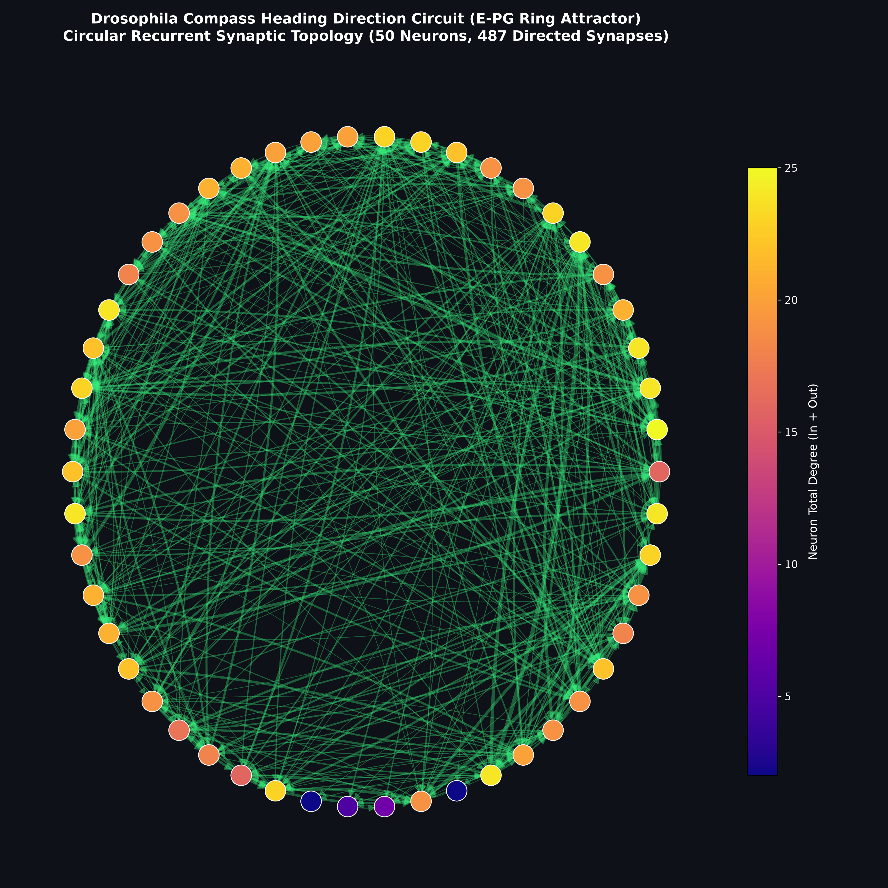
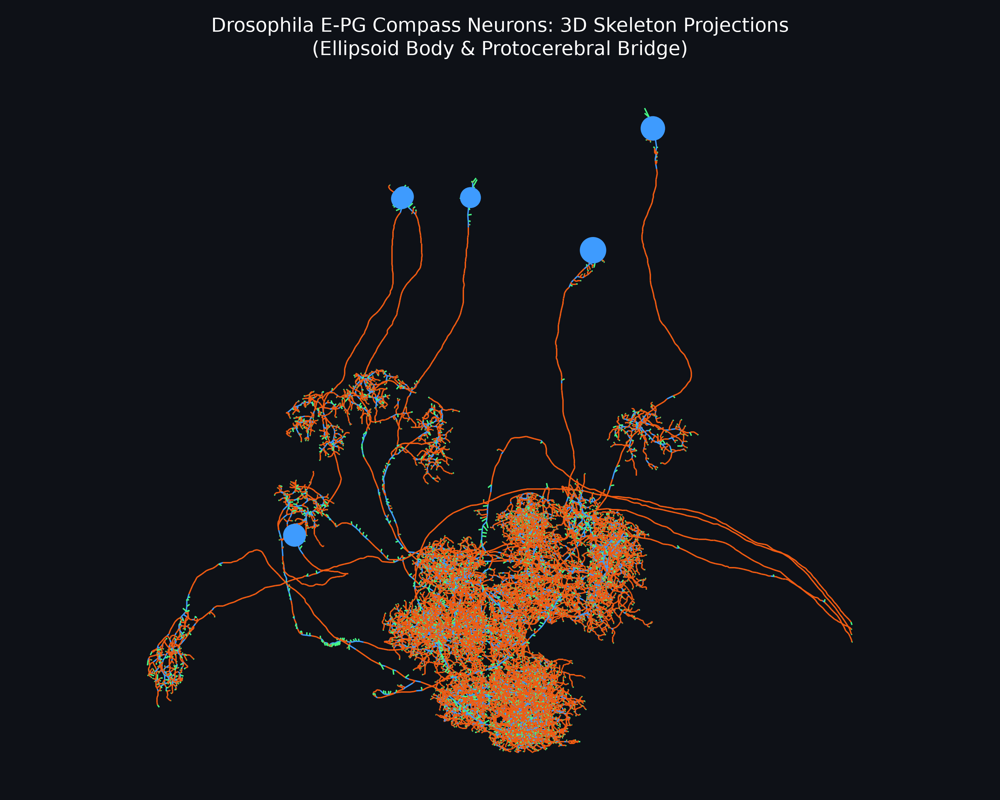

# 🪰 Drosophila Compass Neural Circuit

<p align="center">
  
  
  
  
  
  
</p>

An end-to-end computational connectomics pipeline that interfaces with Janelia Research Campus's **NeuPrint API** (`hemibrain:v1.2.1`) to extract, analyze, and visualize the **heading direction compass circuit** of the fruit fly (*Drosophila melanogaster*). 

The system isolates **E-PG compass neurons** (*Ellipsoid body – Protocerebral bridge – Gall*), computes topological graph metrics without combinatorial cycle explosions, and renders both **2D circular recurrent topologies** and **interactive 3D WebGL anatomical neuron skeletons**.

---

## 📸 Visual Gallery

<table align="center" width="100%">
  <tr>
    <th width="50%" align="center"><b>2D Recurrent Synaptic Topology</b></th>
    <th width="50%" align="center"><b>3D Anatomical Neuron Skeletons</b></th>
  </tr>
  <tr>
    <td align="center">
      
      <br>
      <em>Circular layout of 50 E-PG compass neurons. Node color denotes total degree; directed edge width scales with synaptic weight.</em>
    </td>
    <td align="center">
      
      <br>
      <em>Frontal/dorsal projection of reconstructed skeletons showing the lower <b>Ellipsoid Body (EB donut)</b> and upper <b>Protocerebral Bridge (PB handlebar)</b>.</em>
    </td>
  </tr>
</table>

> [!TIP]
> **Interactive 3D Viewer:** Open [`compass_3d.html`](compass_3d.html) directly in any web browser to rotate, zoom, and inspect full 3D morphology in real-time WebGL.

---

## 🧠 Scientific & Biological Background

In the central complex of the insect brain, the heading direction system functions as a living compass that tracks which way the animal is facing in 360° space:

```
                  ┌────────────────────────────────────────────────────────┐
                  │       Protocerebral Bridge (PB Handlebar)             │
                  │       [L8] [L7] [L6] [L5] | [R5] [R6] [R7] [R8]       │
                  └──────────────────────────┬─────────────────────────────┘
                                             ▲  (Ascending Axon Trunks)
                                             │
                                  ┌──────────┴──────────┐
                                  │   E-PG Compass     │
                                  │     Neurons         │
                                  └──────────▲──────────┘
                                             │  (Dendritic Wedges)
                  ┌──────────────────────────┴─────────────────────────────┐
                  │          Ellipsoid Body (EB Donut Ring)                │
                  │   [Wedge 1] ──> [Wedge 2] ──> [Wedge 3] ... [Wedge 8]  │
                  │           ↺ Local Excitation + Global Inhibition ↻    │
                  └────────────────────────────────────────────────────────┘
```

1. **The Ellipsoid Body (EB) Donut:** The circular EB is divided into radial wedges (like clock sectors). A single localized bump of neural activity moves continuously around the circle as the fly turns.
2. **The Protocerebral Bridge (PB) Handlebar:** E-PG neurons project axons up to bilateral columns across both brain hemispheres. Here, angular velocity signals (from P-EN neurons) shift the heading bump left or right depending on rotational steering.
3. **Continuous Attractor Dynamics:** This network represents one of the most definitive biological implementations of a **Continuous Attractor Neural Network (CANN)**, a foundational architecture in theoretical neuroscience and bio-inspired robotic navigation.

---

## ⚡ Safe Graph Topology & Cycle Analysis

The extracted E-PG circuit consists of **50 neurons and 487 directed synaptic connections**, with an astounding **83.8% reciprocity** and a dense recurrent core of **48 neurons**.

> [!CAUTION]
> **Why `nx.algorithms.cycles.simple_cycles(G)` Freezes Systems:**  
> Enumerating elementary directed cycles in a 50-node dense recurrent graph via Johnson's algorithm encounters a factorial combinatorial explosion ($> 10^{12}$ cycles). This exhausts all system RAM within seconds, causes aggressive swap thrashing, and leads to a hard OS lockup.

### $O(V + E)$ Linear-Time Architecture:
Instead of exponential enumeration, this pipeline confirms recurrent ring attractor connectivity in milliseconds using mathematically sound linear-time checks:

- **Directed Acyclic Graph (DAG) Check (`nx.is_directed_acyclic_graph`):** Runs topological sort in $O(V + E)$ time (~1 ms). Returns `False`, formally proving the presence of directed feedback loops.
- **Strongly Connected Components (`nx.strongly_connected_components`):** Identifies recurrent cores in $O(V + E)$ time, revealing that **48 of 50 neurons** belong to a single recurrent component.
- **Mutual Reciprocal Pairs:** Computes bidirectional links ($u \leftrightarrow v$) in $O(E)$ time, finding **204 bidirectional pairs** providing the physical substrate for activity bump persistence.
- **Exemplar Cycle Extraction (`nx.find_cycle`):** Isolates specific directed feedback loops in linear time without traversing all combinatorial paths.

---

## 📊 Measured Network Metrics

| Metric | Measured Value | Biological / Computational Interpretation |
| :--- | :---: | :--- |
| **Neuron Count (Nodes)** | `50` | Full E-PG neuron population innervating the Ellipsoid Body (`EB`) |
| **Synaptic Links (Edges)** | `487` | Directed connections with total synaptic weight $\ge 3$ |
| **Average In / Out Degree** | `9.74` | Extensive intra-circuit connectivity across azimuthal wedges |
| **Directed Reciprocity** | `83.78%` | Extraordinary mutual feedback reinforcing local excitation |
| **Clustering Coefficient** | `0.6498` | High triadic closure characteristic of ring attractor networks |
| **Recurrent Core Size** | `48 / 50` | 96% of the population forms an unbroken recurrent feedback loop |
| **Reciprocal Link Pairs** | `204 pairs` | Symmetrical connections mediating lateral bump maintenance |
| **Exemplar Feedback Cycle** | `387364605 ⇄ 449438847` | Direct bidirectional synaptic partnership |

---

## 📂 Repository Structure

```text
fruitfly/
├── main.py                     # Modular end-to-end analysis & visualization pipeline
├── requirements.txt            # Python dependencies (neuprint, navis, plotly, networkx, etc.)
├── .gitignore                  # Excludes virtualenvs, cache, and sensitive .env tokens
├── README.md                   # Project documentation, scientific background, and results
│
├── compass_ring.png            # High-DPI (300 DPI) 2D circular topology graph
├── compass_3d_preview.png      # High-DPI 2D projection preview of 3D neuron skeletons
├── compass_3d.html             # Standalone interactive 3D WebGL skeleton visualizer
└── compass_circuit.graphml     # Directed graph export with node/edge metadata
```

---

## 🚀 Getting Started

### 1. Environment Setup

Clone the repository and set up a dedicated virtual environment:

```bash
# Clone repository
git clone https://github.com/iDharshan/fruitfly.git
cd fruitfly

# Create and activate virtual environment
python3 -m venv fly_env
source fly_env/bin/activate

# Install required packages
pip install --upgrade pip
pip install -r requirements.txt
```

### 2. Configure Credentials

Obtain an access token from [neuprint.janelia.org](https://neuprint.janelia.org) (*Sign In $\to$ Account $\to$ Copy Token*).

Add your token to a local `.env` file (this file is excluded by `.gitignore` to prevent credential leaks):

```bash
echo 'NEUPRINT_APPLICATION_CREDENTIALS="your_actual_token_here"' > .env
```

### 3. Execute Pipeline

Run the pipeline cleanly:

```bash
python main.py
```

The script will automatically:
1. Validate connectivity with Janelia's NeuPrint server (`hemibrain:v1.2.1`).
2. Query and extract all E-PG compass neurons and synaptic connections.
3. Compute and log topological graph metrics safely.
4. Render and export `compass_ring.png` (2D topology).
5. Fetch 3D skeleton morphologies via Navis and generate `compass_3d.html` and `compass_3d_preview.png`.

---

## 🕹️ Inspecting the Interactive 3D Model

Launch [`compass_3d.html`](compass_3d.html) in your browser:

```bash
# Linux
xdg-open compass_3d.html
# or
google-chrome compass_3d.html
# or
firefox compass_3d.html
```

### Navigation Controls:
- **Left-Click + Drag:** 360° 3D orbital camera rotation.
- **Scroll Wheel:** Smooth zooming into fine axonal branches and dendritic spines.
- **Right-Click + Drag:** Pan across the brain coordinates.

---

## 📚 References & Acknowledgments

- **Janelia hemibrain dataset:**  
  Scheffer, L.K. et al. (2020). *A connectome and analysis of the adult Drosophila central brain.* **eLife**, 9:e57443. [doi:10.7554/eLife.57443](https://doi.org/10.7554/eLife.57443).
- **Ring Attractor Dynamics in Drosophila:**  
  Turner-Evans, D. et al. (2020). *The neuroanatomical ultrastructure and function of a heading direction circuit.* **Neuron**, 108(1), 145-163.
- **Navis & Connectomics Tools:**  
  Bates, A.S. et al. (2020). *navis: Morphology and connectivity analysis of neuronal data.* [navis.readthedocs.io](https://navis.readthedocs.io/).
