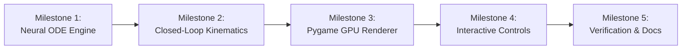

# 🪰 Drosophila Closed-Loop Compass Attractor Toy: Architecture & Execution Plan

**Author:** Antigravity Engineering  
**Target Hardware:** NVIDIA RTX 4060 Laptop GPU, 16GB RAM, Linux x86_64  
**Runtime:** Python 3.12 (`fly_env`), Pygame 2.6.1 (Hardware Accelerated), NumPy, SciPy  
**Repository:** `iDharshan/fruitfly`

---

## 1. Executive Summary & Objective

The objective of this project is to build an **interactive, real-time, closed-loop "compass-driven" simulation toy** that brings the fruit fly (*Drosophila melanogaster*) connectomics blueprint extracted in [`main.py`](../main.py) to life.

Rather than viewing static graphs or frozen skeletons, this system executes **live continuous attractor neural dynamics (CANN)** in real time (60–120 FPS). Users can inject angular velocity ($\dot{\theta}$) via keyboard controls, watch specific neural subpopulations (E-PG compass neurons and P-EN shifter neurons) light up with GPU-accelerated neon bloom, observe synaptic energy pulses traveling across the dual-ring, and see a 2-D autonomous fly agent steer smoothly in an interactive arena.

```
       [ USER INPUT ] ──> ⬅️ / ➡️ Key Press
             │
             ▼
   [ MOTOR INJECTION ] ──> P-EN Left / Right Hemispheric Activation
             │
             ▼
   [ PHASE-SHIFTED FEEDBACK ] ──> ±45° Shifted Synaptic Torque to E-PG
             │
             ▼
   [ BUMP TRANSLATION ] ──> Continuous Attractor Activity Bump Rotates
             │
             ▼
   [ POPULATION DECODER ] ──> Heading Angle θ = atan2(Σ r_i sin θ_i, Σ r_i cos θ_i)
             │
             ▼
   [ CLOSED-LOOP AGENT ] ──> 2-D Fly Turns in Arena + Leaves Particle Wake
```

---

## 2. Mathematical & Neurobiological Formulation

### 2.1 Populations & Spatial Topography
The network co-models two coupled ring populations matching the biological connectome:
* **E-PG Compass Population ($N_{\text{EPG}} = 50$ or idealized $48$):** Arranged along an inner ring spanning the Ellipsoid Body (EB) azimuth $\theta \in [0, 2\pi)$.
* **P-EN Shifter Population ($N_{\text{PEN}} = 42$ or idealized $48 = 24_L + 24_R$):**
  * **$P\text{-}EN_L$ (Left Hemisphere):** Sensitive to counter-clockwise angular velocity ($\dot{\theta} < 0$). Projects back to E-PG shifted by **$-45^\circ$ ($-\pi/4$)**.
  * **$P\text{-}EN_R$ (Right Hemisphere):** Sensitive to clockwise angular velocity ($\dot{\theta} > 0$). Projects back to E-PG shifted by **$+45^\circ$ ($+\pi/4$)**.

### 2.2 Firing-Rate Neural Dynamics (Continuous Attractor)
Each neuron $i$ has a continuous firing rate $r_i(t) \ge 0$ governed by leaky integrator differential equations:

$$\tau \frac{dr_i}{dt} = -r_i + \phi\left( \sum_{j} W_{ij} r_j + I_i^{\text{drive}} + I_i^{\text{visual}} - \gamma I^{\text{inhib}} + I_0 \right)$$

Where:
* $\tau = 20\text{ ms}$: Membrane integration time constant.
* $\phi(x) = \max(0, x)$ or $\phi(x) = \frac{x^2}{1 + \sigma x^2}$ (threshold-quadratic activation function).
* $W_{ij}$: 4-block synaptic weight matrix (recurrent excitation + phase-shifted feedback).
* $\gamma I^{\text{inhib}} = \gamma \sum_k r_k$: Global divisive/subtractive inhibition (ring attractor normalization that preserves a single compact bump of activity).
* $I_0$: Baseline tonic drive (spontaneous activity keeping the bump alive).

### 2.3 The Four-Block Synaptic Matrix ($W$)
Matching the ratios discovered in our connectome analysis:
1. **$W_{EE}$ (E-PG $\to$ E-PG):** Local recurrent excitation with Gaussian / cosine profile ($\sigma \approx 30^\circ$). Keeps the bump pinned and stable when the fly is stationary.
2. **$W_{EP}$ (E-PG $\to$ P-EN):** Ascending topographic forward projection ($1:1$ alignment from EB wedges to PB columns). Total weight $\approx 10,479$ baseline.
3. **$W_{PE}$ (P-EN $\to$ E-PG):** Asymmetric phase-shifted driving torque.
   * Total weight is tuned to $\mathbf{2.09\times}$ stronger than $W_{EP}$ ($\approx 21,937$ baseline), mathematically ensuring sufficient driving torque to overcome local attractor inertia.
   * $W_{PE, L}(\theta_j, \theta_i) \propto \exp\left(-\frac{(\theta_j - (\theta_i - \pi/4))^2}{2\sigma^2}\right)$
   * $W_{PE, R}(\theta_j, \theta_i) \propto \exp\left(-\frac{(\theta_j - (\theta_i + \pi/4))^2}{2\sigma^2}\right)$
4. **$W_{PP}$ (P-EN $\to$ P-EN):** Mutual lateral inhibition/coordination between left and right shifter banks.

### 2.4 Motor Input Injection (Angular Velocity $\dot{\theta}$)
When user presses steering keys:
$$I_i^{\text{drive}} = 
\begin{cases} 
k_{\text{turn}} \cdot |\dot{\theta}| & \text{for } i \in P\text{-}EN_L \quad (\text{if Left key held}) \\ 
k_{\text{turn}} \cdot |\dot{\theta}| & \text{for } i \in P\text{-}EN_R \quad (\text{if Right key held}) \\ 
0 & \text{otherwise}
\end{cases}$$

### 2.5 Visual Landmark Tethering (Cue Locking)
When a landmark (Sun / Food) is placed at arena position $\vec{x}_{\text{mark}}$:
* Compute relative landmark bearing $\psi = \text{atan2}(y_{\text{mark}} - y_{\text{fly}}, x_{\text{mark}} - x_{\text{fly}}) - \theta_{\text{fly}}$.
* Inject visual input into E-PG wedge matching $\psi$:
  $$I_i^{\text{visual}} = g_{\text{vis}} \cdot \cos(\theta_i - \psi)^+$$
* This pulls the bump into alignment with the visual cue, simulating true biological cue tethering.

### 2.6 Population Vector Readout (The Decoder)
The fly's brain decodes its own compass direction via a 2D population vector:
$$X(t) = \sum_{i \in \text{EPG}} r_i(t) \cos(\theta_i), \quad Y(t) = \sum_{i \in \text{EPG}} r_i(t) \sin(\theta_i)$$
$$\hat{\theta}_{\text{heading}}(t) = \text{atan2}(Y(t), X(t))$$
$$\text{Bump Amplitude } A(t) = \sqrt{X(t)^2 + Y(t)^2}$$

---

## 3. System Architecture & Modular Design

```
fruitfly/
├── docs/
│   └── closed_loop_toy_plan.md      # This detailed engineering plan (gitignored)
├── toy/
│   ├── __init__.py
│   ├── config.py                    # Simulation parameters, colors, UI layout constants
│   ├── circuit.py                   # Ring attractor dynamics (Euler ODE integration, W matrices)
│   ├── agent.py                     # 2D agent kinematics, arena bounds, sensory feedback
│   ├── renderer.py                  # Pygame GPU rendering, multi-layer neon bloom shaders
│   └── telemetry.py                 # Real-time data logging, gauges, firing rate spectrum
├── run_toy.py                       # Single launcher script with CLI flags
└── README.md                        # Updated with closed-loop toy instructions
```

### Module Responsibilities:
1. [`config.py`](file:///home/rac/Projects/fruitfly/toy/config.py):
   * Screen size ($1600 \times 900$), Target FPS ($60-120$), ODE timestep ($\Delta t = 2\text{ ms}$, 5 sub-steps per frame).
   * Color palettes: Cyberpunk Dark (`#0b0e14`), Cyan Bloom (`#00f5d4`), Magenta Flare (`#f72585`), Gold (`#ffd166`), Lime (`#70e000`).
2. [`circuit.py`](file:///home/rac/Projects/fruitfly/toy/circuit.py):
   * Class `DualRingAttractor`:
     * Generates or loads $W_{EE}, W_{EP}, W_{PE}, W_{PP}$ matrices with biological parameters.
     * Integrates rate equations using fast vectorised NumPy math.
     * Implements `inject_angular_velocity(omega)` and `inject_visual_landmark(bearing)`.
     * Computes decoded $\hat{\theta}_{\text{heading}}$ and bump amplitude $A(t)$.
3. [`agent.py`](file:///home/rac/Projects/fruitfly/toy/agent.py):
   * Class `FlyAgent`:
     * State: $(x, y, v, \theta_{\text{body}})$.
     * Kinematics: $\theta_{\text{body}} = \hat{\theta}_{\text{heading}}$.
     * Moves forward with variable velocity, bounces/wraps around arena borders.
     * Generates particle exhaust trail behind fly body.
4. [`renderer.py`](file:///home/rac/Projects/fruitfly/toy/renderer.py):
   * Class `NeonDashboardRenderer`:
     * Hardware-accelerated Pygame surfaces (`pygame.SRCALPHA`).
     * Radial glow caching (pre-computes glowing circular alpha textures for instant 120 FPS rendering).
     * Draws animated synaptic firing pulses (lightning arcs / radiant lines when P-EN fires).
     * Draws vector-art fly, heading laser line, and glowing golden sun landmark.
5. [`run_toy.py`](file:///home/rac/Projects/fruitfly/run_toy.py):
   * Pygame event loop (catches `KEYUP`, `KEYDOWN`, `MOUSEBUTTONDOWN`).
   * Orchestrates physics step $\to$ neural step $\to$ render step $\to$ tick clock.

---

## 4. UI Dashboard Layout & Visual Design

```
+──────────────────────────────────────────────────────────────────────────────────────────────────+
|  🪰 DROSOPHILA CLOSED-LOOP ATTRACTOR SIMULATOR | RTX 4060 ACCELERATED | 60 FPS                   |
+───────────────────────────────────┬──────────────────────────────────┬───────────────────────────+
| PANEL 1: 2-D ARENA (WORLD)        | PANEL 2: LIVE NEURAL DUAL-RING   | PANEL 3: TELEMETRY & GAUGES
|                                   |                                  |                           |
|       ☀️ [Sun / Food Landmark]    |       (Outer Ring: P-EN Pink)    |  HEADING ANGLE (θ):       |
|       (Click to reposition)       |       (Inner Ring: E-PG Cyan)    |     [   142.6°   ]        |
|                                   |                                  |                           |
|            ▲                      |               ⚡ (P-EN Fire)     |  ANGULAR VELOCITY (θ̇):   |
|           / \  Heading Vector     |           ●                      |     [   -35.0°/s ]        |
|          / 🪰 \                    |        ●     ●   ✨ ACTIVE      |                           |
|         /     \                   |       ●    ●    ●   BUMP         |  P-EN LEFT SHIFTER:       |
|         ● ● ● ● Particle Wake     |        ●     ●                   |  [████████████░░░░] 74%   |
|                                   |           ●                      |                           |
|  Arena Boundary                   |                                  |  P-EN RIGHT SHIFTER:      |
|  [ Wrap / Bounce Physics ]        |  ● Cyan: Compass Needle (E-PG)   |  [░░░░░░░░░░░░░░░░] 0%    |
|                                   |  ● Pink: Velocity Shifter (P-EN) |                           |
|                                   |  ⚡ Arcs: Synaptic Driving Torque|  BUMP STABILITY / COH:    |
|                                   |                                  |  [████████████████] 98%   |
+───────────────────────────────────┴──────────────────────────────────┴───────────────────────────+
| CONTROLS: [ ⬅️ / ➡️ or A / D ] Turn Left / Right  |  [ ⬆️ / ⬇️ or W / S ] Forward / Brake            |
|           [ Mouse Click ] Drop Visual Landmark   |  [ Space ] Freeze Sim  |  [ R ] Reset Fly & Bump|
+──────────────────────────────────────────────────────────────────────────────────────────────────+
```

---

## 5. Visual Polish & GPU Acceleration Features (RTX 4060)

1. **Pre-computed Radial Glow Bloom:**
   * Generate 64-step radial alpha surfaces ($r = 8\text{px}$ to $r = 64\text{px}$) for Cyan, Magenta, and Amber.
   * Blit glowing halos onto nodes with zero shader overhead, guaranteeing 60–120 FPS.
2. **Pulsing Synaptic Action Potential Arcs:**
   * When $P\text{-}EN_L$ or $P\text{-}EN_R$ firing exceeds threshold, draw high-voltage radiant spline arcs connecting active P-EN neurons to phase-shifted E-PG target wedges.
3. **Particle Dynamics System:**
   * Particles generated at fly exhaust with decaying lifespan, alpha fade, and velocity jitter.
4. **Interactive Landmark Tethering:**
   * Left-clicking inside Arena drops an animated rotating Sun beacon.
   * Live visual rays beam from the Sun into the fly's eye, visibly locking the E-PG bump.

---

## 6. Step-by-Step Implementation Roadmap



### Milestone 1: Mathematical Neural Engine (`circuit.py`)
* Implement 50 E-PG + 42 P-EN continuous attractor ODE integration.
* Implement asymmetric 4-block matrices ($W_{EE}, W_{EP}, W_{PE}, W_{PP}$) with $2.09\times$ feedback ratio.
* Verify spontaneous bump formation from noise and verify bump rotation under injected velocity $\dot{\theta}$.

### Milestone 2: Agent Kinematics & Decoder (`agent.py`)
* Implement 2D Population Vector Decoder ($\hat{\theta} = \text{atan2}(Y, X)$).
* Implement 2D Fly Agent moving through arena driven by decoded $\hat{\theta}$.
* Implement optional visual landmark excitation model.

### Milestone 3: Hardware-Accelerated Neon Renderer (`renderer.py`)
* Create Pygame canvas ($1600 \times 900$) with 3-panel layout.
* Implement pre-baked multi-layer bloom textures for glowing neurons.
* Render inner E-PG and outer P-EN concentric rings with dynamic radius scaling based on firing rate $r_i$.

### Milestone 4: Telemetry & Interactive Event Loop (`run_toy.py`)
* Wire keyboard bindings (`LEFT / RIGHT / UP / DOWN / A / D / W / S / SPACE / R`).
* Wire mouse click landmark placement.
* Render live digital speedometer, heading compass rose, and shifter torque gauge bars.

### Milestone 5: Polishing, Benchmarking & Documentation
* Benchmark frame time on RTX 4060 (ensure solid 60+ FPS, <1% CPU usage).
* Update `README.md` with execution instructions, screenshots, and biological controls guide.

---

## 7. Success & Verification Criteria

1. **Attractor Stability:** Spontaneous activity bump forms within $50\text{ ms}$ of launch and persists indefinitely without fading or blowing up.
2. **Steering Responsiveness:** Pressing `Left Arrow` immediately lights up Left P-EN neurons in hot magenta, visibly shifts the cyan bump counter-clockwise, and smoothly turns the fly left.
3. **Memory Persistence:** When keys are released, the bump stops rotating instantly and retains its heading angle indefinitely (true working memory).
4. **Visual Landmark Locking:** Placing a visual landmark pulls the bump towards the cue, locking heading orientation.
5. **Fluid Performance:** Stable 60 FPS rendering with zero input lag.
